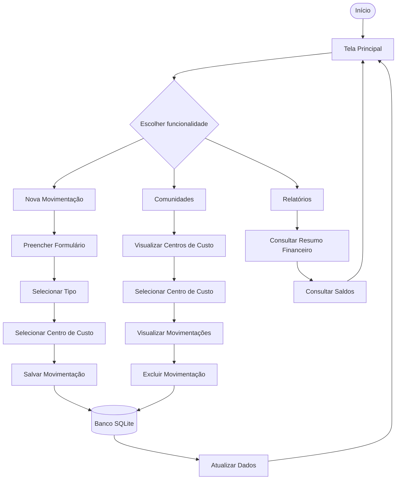

# Unidos

Aplicativo mobile para gerenciamento e acompanhamento financeiro de centros de custo e comunidades.

## 1. Tema do Projeto

O **Unidos** é um aplicativo mobile desenvolvido para auxiliar no gerenciamento financeiro de comunidades e centros de custo. A aplicação permite registrar entradas e saídas de valores, acompanhar saldos individuais e visualizar um resumo financeiro geral.

O projeto busca solucionar a dificuldade de controlar movimentações financeiras de diferentes comunidades de forma organizada, centralizando as informações em um único aplicativo.

A aplicação permite que o usuário mantenha os registros financeiros separados por centro de custo, possibilitando consultar o saldo individual de cada comunidade e também o saldo total de todos os centros cadastrados.

## 2. Motivação

A escolha do tema surgiu da necessidade de facilitar o controle financeiro de comunidades e instituições que realizam movimentações de entrada e saída de recursos.

Em muitos casos, esse controle é realizado manualmente por meio de anotações, planilhas ou documentos físicos, dificultando a consulta das informações e aumentando a possibilidade de erros.

O aplicativo **Unidos** foi desenvolvido como uma solução simples e prática para:

* Organizar as movimentações financeiras;
* Separar os valores por centro de custo;
* Facilitar o acompanhamento dos saldos;
* Reduzir a dependência de controles manuais;
* Centralizar as informações financeiras;
* Facilitar a consulta das movimentações realizadas;
* Auxiliar na prestação de contas;
* Apoiar o acompanhamento financeiro das comunidades.

## 3. Escopo do Projeto

### 3.1 Funcionalidades dentro do escopo

O projeto contempla inicialmente as seguintes funcionalidades:

* Cadastro de centros de custo;
* Cadastro de movimentações financeiras;
* Classificação das movimentações como entrada ou saída;
* Associação de uma movimentação a um centro de custo;
* Consulta dos centros de custo cadastrados;
* Consulta do saldo individual de cada centro de custo;
* Consulta do saldo total dos centros de custo;
* Consulta do saldo do caixa pessoal;
* Visualização das últimas movimentações;
* Visualização de todas as movimentações;
* Visualização das movimentações de um centro de custo específico;
* Exclusão de centros de custo;
* Exclusão de movimentações;
* Exibição da data das movimentações;
* Resumo financeiro por centro de custo;
* Relatórios e informações financeiras consolidadas;
* Atualização dos dados por meio da interação com a interface;
* Armazenamento local das informações utilizando SQLite.

### 3.2 Funcionalidades fora do escopo inicial

As seguintes funcionalidades não fazem parte do escopo inicial do projeto:

* Sistema de autenticação com login e senha;
* Cadastro de múltiplos usuários;
* Sincronização de dados com servidor remoto;
* Banco de dados em nuvem;
* Acesso simultâneo por múltiplos usuários;
* Integração com instituições bancárias;
* Transferências bancárias;
* Pagamentos diretamente pelo aplicativo;
* Emissão de documentos fiscais;
* Integração com sistemas externos de contabilidade.

Essas funcionalidades poderão ser consideradas em versões futuras do projeto.

## 4. Fluxo de Utilização

O fluxo básico de utilização da aplicação é:

1. O usuário inicia o aplicativo;
2. O sistema apresenta a tela principal;
3. O usuário visualiza o resumo financeiro;
4. O usuário pode consultar o saldo do caixa pessoal;
5. O usuário pode consultar o saldo das comunidades e centros de custo;
6. O usuário pode cadastrar um novo centro de custo;
7. O usuário pode selecionar um centro de custo;
8. O usuário pode consultar as movimentações daquele centro de custo;
9. O usuário pode cadastrar uma nova movimentação;
10. O usuário informa a descrição da movimentação;
11. O usuário informa o valor;
12. O usuário seleciona o tipo da movimentação, entrada ou saída;
13. O usuário seleciona o centro de custo relacionado;
14. O sistema registra a data da movimentação;
15. O sistema salva os dados no banco de dados SQLite;
16. O sistema atualiza os saldos automaticamente;
17. O usuário pode consultar todas as movimentações;
18. O usuário pode visualizar relatórios e resumos financeiros;
19. O usuário pode excluir movimentações ou centros de custo quando necessário.

### Fluxo resumido

```text
Início
   |
   v
Tela Principal
   |
   +-------------------+
   |                   |
   v                   v
Comunidades       Movimentações
   |                   |
   v                   v
Selecionar         Cadastrar
Centro de          Movimentação
Custo                  |
   |                   v
   v              Selecionar Centro
Ver Saldo              de Custo
   |                   |
   v                   v
Ver Movimentações   Salvar
   |                   |
   +---------+---------+
             |
             v
          SQLite
             |
             v
      Atualizar Saldos
             |
             v
         Relatórios
```

## 5. Fluxograma

O funcionamento principal da aplicação pode ser representado pelo seguinte fluxograma:



O fluxograma representa o fluxo principal de interação do usuário com o aplicativo, desde o acesso à tela principal até o cadastro, consulta e exclusão de informações financeiras.

## 6. Requisitos Funcionais

### RF01 – Cadastro de centro de custo

O sistema deve permitir o cadastro de novos centros de custo.

### RF02 – Listagem de centros de custo

O sistema deve permitir visualizar os centros de custo cadastrados.

### RF03 – Cadastro de movimentação

O sistema deve permitir cadastrar movimentações financeiras.

### RF04 – Definição do tipo da movimentação

O sistema deve permitir classificar uma movimentação como entrada ou saída.

### RF05 – Associação ao centro de custo

O sistema deve permitir associar cada movimentação a um centro de custo.

### RF06 – Registro da data

O sistema deve registrar a data e o horário em que uma movimentação foi realizada.

### RF07 – Consulta de saldo

O sistema deve calcular e apresentar o saldo individual de cada centro de custo.

### RF08 – Consulta do saldo total

O sistema deve calcular e apresentar o saldo total considerando todos os centros de custo.

### RF09 – Consulta do caixa pessoal

O sistema deve permitir visualizar o saldo do centro de custo destinado ao caixa pessoal.

### RF10 – Consulta de movimentações

O sistema deve permitir consultar as movimentações cadastradas.

### RF11 – Consulta por centro de custo

O sistema deve permitir visualizar somente as movimentações relacionadas a um determinado centro de custo.

### RF12 – Exclusão de movimentação

O sistema deve permitir excluir uma movimentação cadastrada.

### RF13 – Exclusão de centro de custo

O sistema deve permitir excluir um centro de custo cadastrado, respeitando as regras definidas pelo sistema.

### RF14 – Visualização das últimas movimentações

O sistema deve apresentar as movimentações mais recentes na tela principal.

### RF15 – Relatórios financeiros

O sistema deve apresentar informações consolidadas sobre os saldos e movimentações financeiras.

### RF16 – Atualização dos dados

O sistema deve permitir atualizar as informações apresentadas após alterações nos registros.

### RF17 – Persistência dos dados

O sistema deve armazenar os dados cadastrados localmente para que permaneçam disponíveis após o encerramento da aplicação.

## 7. Tecnologias Utilizadas

### Flutter

Framework utilizado para o desenvolvimento da interface e da aplicação mobile.

### Dart

Linguagem de programação utilizada no desenvolvimento do aplicativo.

### SQLite

Banco de dados utilizado para armazenamento local das informações.

### Sqflite

Biblioteca utilizada para realizar a integração entre a aplicação Flutter e o banco de dados SQLite.

### Material Design

Utilizado como base para a construção dos componentes visuais e da interface do aplicativo.

### Git

Utilizado para controle de versão do código-fonte.

### GitHub

Utilizado para hospedagem do repositório e acompanhamento da evolução do projeto por meio do histórico de commits.

## 8. Persistência de Dados

O aplicativo utiliza o banco de dados **SQLite** para realizar o armazenamento local das informações.

### Centros de Custo

Os centros de custo possuem os seguintes dados:

* ID;
* Nome.

### Movimentações

As movimentações possuem os seguintes dados:

* ID;
* Descrição;
* Valor;
* Tipo da movimentação;
* Centro de custo relacionado;
* Data da movimentação.

A estrutura permite relacionar cada movimentação a um centro de custo, possibilitando o cálculo individual e geral dos saldos.

## 9. Recursos de Programação em Dart

Durante o desenvolvimento do projeto são utilizados diversos recursos da linguagem Dart, incluindo:

* Classes;
* Objetos;
* Construtores;
* Métodos;
* Funções;
* Funções assíncronas;
* `Future`;
* `async` e `await`;
* Estruturas condicionais;
* Estruturas de repetição;
* Listas;
* Manipulação de coleções;
* `map`;
* `where`;
* `FutureBuilder`;
* `StatefulWidget`;
* `StatelessWidget`;
* Gerenciamento de estado com `setState`;
* Tratamento de eventos;
* Navegação entre telas;
* Comunicação com banco de dados;
* Organização do código em diferentes camadas.

## 10. Interface Gráfica

O aplicativo possui uma interface gráfica desenvolvida com Flutter e utiliza múltiplas telas para organizar suas funcionalidades.

Entre as principais telas estão:

* Tela inicial;
* Tela de comunidades e centros de custo;
* Tela de cadastro de centro de custo;
* Tela de cadastro de movimentações;
* Tela de movimentações de um centro de custo;
* Tela de todas as movimentações;
* Tela de relatórios.

A aplicação utiliza componentes como:

* `AppBar`;
* `BottomNavigationBar`;
* `Card`;
* `ListTile`;
* `TextField`;
* `DropdownButton`;
* `ElevatedButton`;
* `FloatingActionButton`;
* `SnackBar`;
* `AlertDialog`;
* `RefreshIndicator`;
* `ListView`.

## 11. Interação com o Usuário

O sistema possui mecanismos de interação e feedback para facilitar a utilização da aplicação.

Entre eles:

* Formulários para cadastro;
* Seleção de centro de custo;
* Seleção do tipo de movimentação;
* Botões de ação;
* Navegação entre telas;
* Atualização das informações;
* Confirmação antes da exclusão de registros;
* Mensagens de sucesso;
* Mensagens de erro;
* Exclusão de registros por meio de toque prolongado sobre os itens.

## 12. Estrutura do Projeto

A estrutura principal do projeto está organizada da seguinte maneira:

```text
lib/
├── db/
│   └── database.dart
│
├── entity/
│   ├── centro_custo.dart
│   └── movimentacao.dart
│
├── service/
│   ├── centro_custo_service.dart
│   └── movimentacoes_service.dart
│
├── telas/
│   ├── home_page.dart
│   ├── comunidades_page.dart
│   ├── cadastro_centro_tela.dart
│   ├── cadastro_movimentacao_page.dart
│   ├── movimentacoes_centro_custo_page.dart
│   └── relatorios_page.dart
│
└── main.dart
```

A organização busca separar as responsabilidades do sistema em diferentes camadas:

* **Entity:** representa os modelos de dados;
* **Database:** responsável pela inicialização e configuração do banco SQLite;
* **Service:** responsável pelas operações de persistência e regras relacionadas aos dados;
* **Telas:** contém as interfaces gráficas da aplicação;
* **Main:** responsável pela inicialização do aplicativo.

## 13. Requisitos Mínimos de Desenvolvimento Contemplados

### Interface Gráfica

* [x] Múltiplas telas;
* [x] Navegação entre telas;
* [x] Componentes visuais adequados;
* [x] Interface organizada;
* [x] Layout adaptável utilizando widgets do Flutter.

### Interação com o Usuário

* [x] Formulários;
* [x] Entrada de dados;
* [x] Seleção de centro de custo;
* [x] Validação e tratamento de informações;
* [x] Mensagens de feedback;
* [x] Confirmação para exclusão de registros.

### Persistência de Dados

* [x] SQLite;
* [x] Operações de inserção;
* [x] Operações de consulta;
* [x] Operações de atualização;
* [x] Operações de exclusão.

### Recursos de Programação

* [x] Funções;
* [x] Estruturas condicionais;
* [x] Estruturas de repetição;
* [x] Manipulação de listas;
* [x] Manipulação de coleções;
* [x] Programação assíncrona;
* [x] Organização do código em classes e serviços.

## 14. Controle de Versão

O projeto utiliza **Git** para controle de versão e **GitHub** para hospedagem do código-fonte.

O desenvolvimento é acompanhado por meio do histórico de commits, permitindo visualizar a evolução da aplicação ao longo do projeto.

Os commits são utilizados para registrar etapas como:

* Criação da estrutura inicial;
* Implementação do banco de dados;
* Criação das entidades;
* Implementação dos serviços;
* Criação das telas;
* Implementação das funcionalidades;
* Correções de erros;
* Melhorias na interface;
* Atualizações da documentação.

## 15. Como Executar o Projeto

### Pré-requisitos

Para executar o projeto é necessário possuir:

* Flutter SDK instalado;
* Dart SDK;
* Android Studio ou outro ambiente compatível;
* Git;
* Um dispositivo Android ou emulador configurado.

### Clonar o repositório

```bash
git clone URL_DO_REPOSITORIO
```

### Entrar na pasta do projeto

```bash
cd unidos
```

### Instalar as dependências

```bash
flutter pub get
```

### Executar o projeto

```bash
flutter run
```

### Gerar uma versão de produção para Android

```bash
flutter build apk --release
```

O arquivo APK será gerado em:

```text
build/app/outputs/flutter-apk/
```

## 16. Considerações Finais

O projeto **Unidos** tem como objetivo desenvolver uma solução prática para organização e acompanhamento financeiro de comunidades e centros de custo.

A aplicação foi desenvolvida utilizando Flutter e Dart, com armazenamento local em SQLite, permitindo trabalhar conceitos de desenvolvimento de interfaces gráficas, navegação entre telas, persistência de dados, programação orientada a objetos, manipulação de coleções e operações assíncronas.

O projeto também foi estruturado de forma modular, buscando facilitar a manutenção e a evolução futura da aplicação.

Como proposta de evolução, o sistema poderá futuramente receber funcionalidades como autenticação de usuários, sincronização em nuvem, compartilhamento de dados entre usuários, integração com serviços externos e geração de documentos para prestação de contas.
